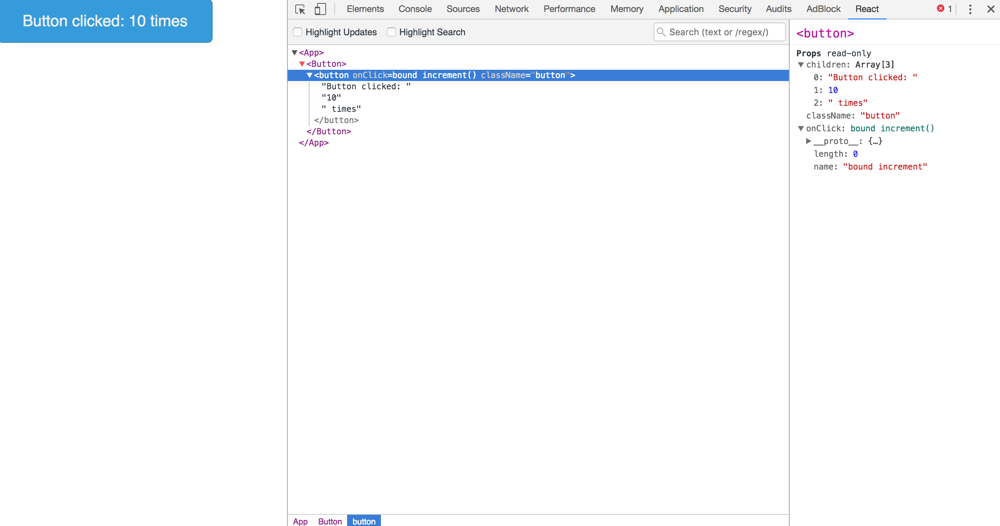

# React gulp boilerplate



Boilerplate for React applications with Sass

## Installation

```shell
    npm install # to install dependencies
    gulp # to build and watch tasks
```

if you get an error something like:

```
/home/me/.nvm/versions/node/v6.9.2/lib/node_modules/gulp/bin/gulp.js:129
    gulpInst.start.apply(gulpInst, toRun);
                  ^

TypeError: Cannot read property 'apply' of undefined
    at /home/me/.nvm/versions/node/v6.9.2/lib/node_modules/gulp/bin/gulp.js:129:19
    at _combinedTickCallback (internal/process/next_tick.js:67:7)
    at process._tickCallback (internal/process/next_tick.js:98:9)
    at Module.runMain (module.js:606:11)
    at run (bootstrap_node.js:394:7)
    at startup (bootstrap_node.js:149:9)
    at bootstrap_node.js:509:3
```

then run `npm install -g gulp-cli`.